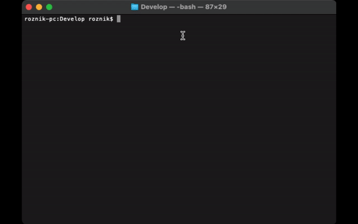
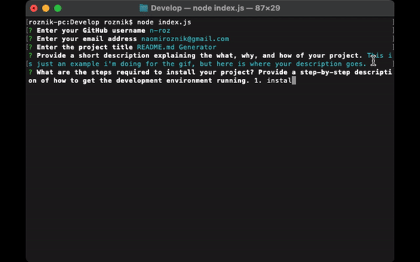

# Professional README Generator

## Description

Do you struggle with creating a README.md after you finish a project? Do you dislike having to sit down after you finish a frustrating project only to have to then write about that frustrating project? Fear no more! For I have created a simple README.md generator that you can use from your command line.

For more information about how to create a professional README, please review this [FullStack guide.](https://coding-boot-camp.github.io/full-stack/github/professional-readme-guide)

## Table of Contents
- [User Story](#userstory)
- [Acceptance Criteria](#acceptancecriteria)
- [Installation](#installation)
- [Usage](#usage)
- [Contributors](#contributors)
- [Tests](#tests)
- [Questions](#questions)
- [License](#license)

## User Story
```
AS A developer
I WANT a README generator
SO THAT I can quickly create a professional README for a new project
```

## Acceptance Criteria
```
GIVEN a command-line application that accepts user input
WHEN I am prompted for information about my application repository
THEN a high-quality, professional README.md is generated with the title of my project and sections entitled Description, Table of Contents, Installation, Usage, License, Contributing, Tests, and Questions
WHEN I enter my project title
THEN this is displayed as the title of the README
WHEN I enter a description, installation instructions, usage information, contribution guidelines, and test instructions
THEN this information is added to the sections of the README entitled Description, Installation, Usage, Contributing, and Tests
WHEN I choose a license for my application from a list of options
THEN a badge for that license is added near the top of the README and a notice is added to the section of the README entitled License that explains which license the application is covered under
WHEN I enter my GitHub username
THEN this is added to the section of the README entitled Questions, with a link to my GitHub profile
WHEN I enter my email address
THEN this is added to the section of the README entitled Questions, with instructions on how to reach me with additional questions
WHEN I click on the links in the Table of Contents
THEN I am taken to the corresponding section of the README
```

## Installation
- Confirm Node.js is installed on your computer using ```node -v``` in the command line. Node Installation Guide on the [Full-Stack Blog.](https://coding-boot-camp.github.io/full-stack/nodejs/how-to-install-nodejs)
- Use ```git clone``` to clone the project locally.
- Please ```cd``` into the ```Develop``` folder. This is one mistake I made in my project that should be fixed, but I have not been able to get the filepaths working again once I move the files and eventually I gave up. Resubmission is a possibility I'm considering.
- You will use the [Inquirer package](https://www.npmjs.com/package/inquirer/v/8.2.4) to dynamically create the README.md file from the user's input. Enter ```npm init``` and then ```npm i inquirer@8.2.4``` in the command line.

## Usage
The application is invoked in the command line by entering:
```
node index.js
```





## Contributors
[n-roz on GitHub](https://github.com/n-roz) with assistance from AskBCS.

## License
MIT

## Questions
[My GitHub: https://github.com/n-roz](https://github.com/n-roz)